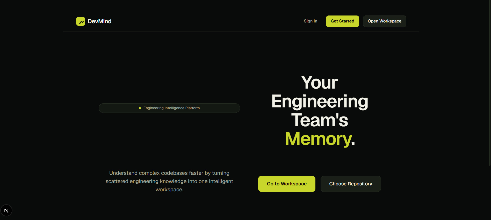
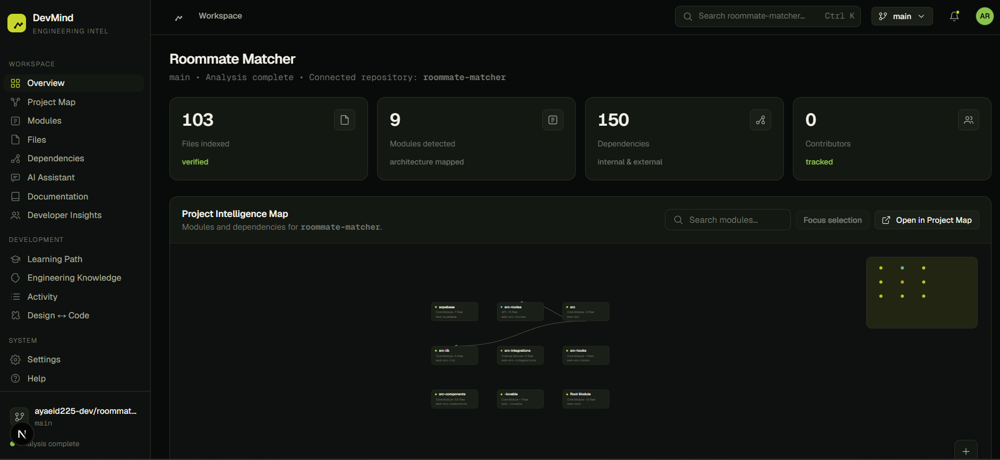
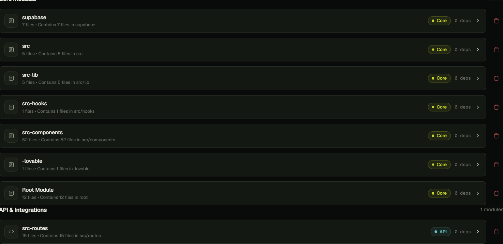
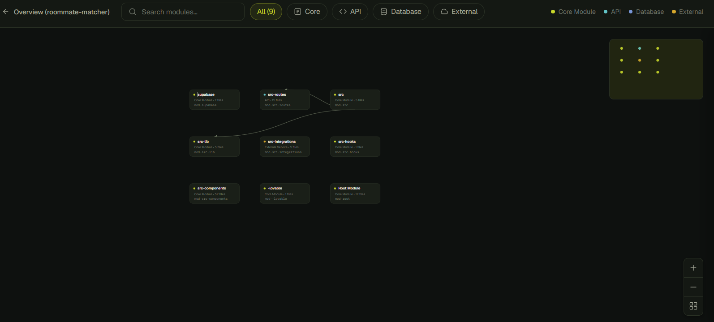
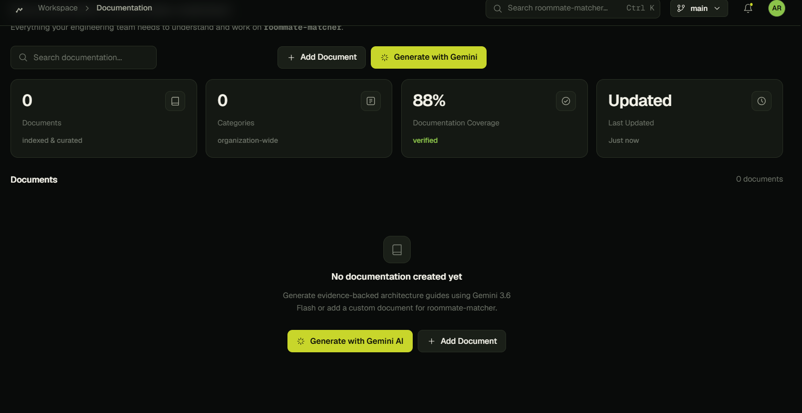
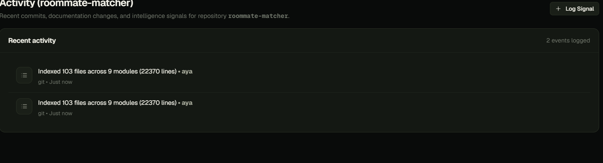
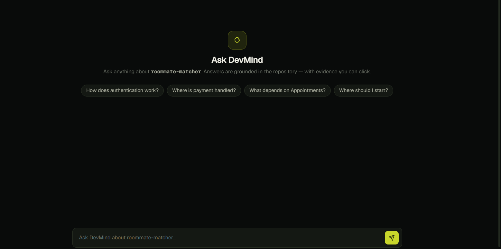
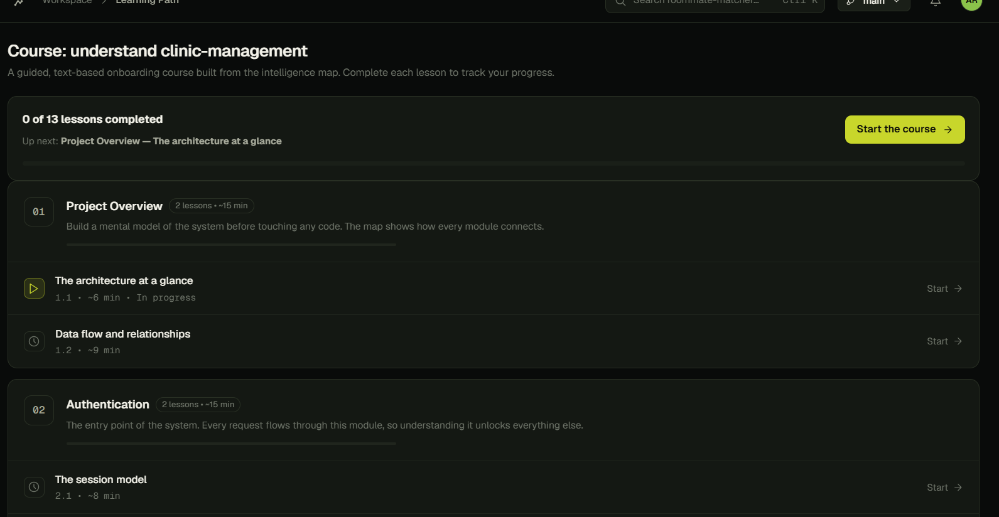

# DevMind AI 🧠

### Engineering Intelligence Platform

**DevMind AI** is an engineering intelligence platform designed to help software teams understand, navigate, and interact with their codebases through an AI-powered workspace.

Instead of treating a repository as a collection of files, DevMind brings together **code understanding, repository context, project structure, engineering insights, and AI assistance** in one unified experience.

> **Ask questions. Get evidence. Understand your codebase.**

---

## 🎯 Why DevMind?

Modern software projects become increasingly difficult to understand as they grow.

Developers often need to move between:

* Source code
* Documentation
* Dependencies
* Git history
* Project structure
* Developer activity
* AI tools

**DevMind** aims to bring these pieces together into a single engineering workspace.

---

## ✨ Core Features

### 🔗 GitHub Repository Integration

Connect a GitHub account and work with real repositories inside the DevMind workspace.

* GitHub OAuth authentication
* Repository selection
* Repository-aware workspace
* Repository data ingestion
* Project context synchronization

### 🧠 AI Engineering Assistant

Interact with an AI assistant that works with the selected repository context.

* Ask engineering questions
* Explore project structure
* Understand implementation details
* Get contextual explanations
* Generate engineering-oriented insights

### 📊 Project Overview

Get a high-level view of the selected software project.

* Repository information
* Project statistics
* Engineering activity
* Project structure
* Development insights

### 🧩 Modules

Explore the major modules and components of a software project.

* Module discovery
* Module details
* Related files
* AI-assisted module analysis

### 🗺️ Project Map

Visualize relationships between different parts of the codebase.

* Project structure
* Component relationships
* Dependencies
* Codebase navigation

### 📚 Documentation

Centralize and explore project documentation.

* Documentation browsing
* Document details
* Repository-aware context
* AI-assisted documentation workflows

### 👨‍💻 Developer Activity

Understand activity across the repository.

* Developer information
* Activity history
* Contribution context
* Engineering insights

### 📖 Learning Path

Provide contextual learning resources based on the project and technologies being explored.

---

# 🖼️ Product Showcase

## 🏠 Home

<p align="center">
  
</p>

---

## 📊 Dashboard

<p align="center">
  
</p>

---

## 🔗 Repository Overview

<p align="center">
  
</p>

---

## 🧩 Modules

<p align="center">
  
</p>

---

## 🗺️ Project Map

<p align="center">
  
</p>

---

## 📚 Documentation

<p align="center">
  
</p>

---

## 📈 Activity

<p align="center">
  
</p>

---

## 🤖 AI Assistant

<p align="center">
  
</p>

---

## 📖 Learning Path

<p align="center">
  
</p>

---

# 🏗️ Platform Architecture

At a high level, DevMind connects the following layers:

```text
                    ┌──────────────────────┐
                    │      GitHub Repo     │
                    └──────────┬───────────┘
                               │
                               ▼
                    ┌──────────────────────┐
                    │ Repository Ingestion │
                    └──────────┬───────────┘
                               │
                               ▼
                    ┌──────────────────────┐
                    │ Project Intelligence │
                    └──────────┬───────────┘
                               │
             ┌─────────────────┼─────────────────┐
             ▼                 ▼                 ▼
        Project Map        Modules          Documentation
             │                 │                 │
             └─────────────────┼─────────────────┘
                               ▼
                    ┌──────────────────────┐
                    │    AI Assistant      │
                    └──────────────────────┘
```

The architecture is designed around a **repository-aware engineering workspace**, allowing different parts of the platform to operate using the currently selected repository context.

---

# 🧠 AI Capabilities

DevMind integrates AI into the engineering workflow to support:

* Repository understanding
* Codebase exploration
* Module analysis
* Engineering questions
* Documentation assistance
* Contextual explanations
* Learning recommendations

The goal is not simply to provide a generic chatbot, but to create an AI experience that is aware of the software project being explored.

---

# 🛠️ Tech Stack

| Technology       | Purpose                           |
| ---------------- | --------------------------------- |
| **Next.js**      | Web application framework         |
| **React**        | UI development                    |
| **TypeScript**   | Type-safe application development |
| **Tailwind CSS** | UI styling                        |
| **GitHub API**   | Repository integration            |
| **GitHub OAuth** | Account authentication            |
| **Gemini API**   | AI capabilities                   |
| **Prisma**       | Data access layer                 |
| **SQLite**       | Local development database        |

---

# 🔐 Security

DevMind is designed with security in mind.

Sensitive credentials should **never be committed to the repository**.

Environment variables are used for secrets such as:

```text
GITHUB_CLIENT_ID
GITHUB_CLIENT_SECRET
GEMINI_API_KEY
```

For production deployments, credentials should be stored using secure environment-variable management.

---

# 🚀 Getting Started

## Prerequisites

Make sure you have:

* Node.js
* npm
* Git
* A GitHub account
* Required API credentials for GitHub and AI features

## Installation

Clone the repository:

```bash
git clone https://github.com/ayaeid225-dev/devmind.git
```

Navigate into the project:

```bash
cd devmind
```

Install dependencies:

```bash
npm install
```

Create your environment file:

```text
.env.local
```

Configure the required environment variables.

Then start the development server:

```bash
npm run dev
```

Open the application at:

```text
http://localhost:3000
```

---

# 📁 Project Structure

```text
devmind/
│
├── app/
│   ├── api/
│   ├── app/
│   ├── connect/
│   └── repos/
│
├── components/
│   ├── shell/
│   └── ui/
│
├── lib/
│   ├── server/
│   ├── map-helper.ts
│   ├── nav.ts
│   └── shell-context.tsx
│
├── screenshots/
│   ├── activity.png
│   ├── ai-assistant.png
│   ├── dashboard-overview.png
│   ├── documentation.png
│   ├── home.png
│   ├── learning-path.png
│   ├── modules.png
│   ├── project-map.png
│   └── repository-overview.png
│
├── public/
├── package.json
└── README.md
```

---

# 🗺️ Roadmap

Future development may include:

* Advanced repository intelligence
* Deeper code dependency analysis
* Improved AI reasoning over large codebases
* More powerful documentation generation
* Engineering team insights
* Advanced project analytics
* Expanded integrations with developer tools

---

# 🎓 Project

DevMind AI is a collaborative software engineering project focused on exploring how AI can become a contextual member of the software development workflow.

The project combines:

* Artificial Intelligence
* Software engineering
* Repository analysis
* Developer tooling
* Data visualization
* API integrations
* Modern web application development

---

# 👥 Team

### Aya Eid El Sayed & Marwan Mohamed

**Co-creators of DevMind AI**

DevMind AI is a collaborative project created by **Aya Eid El Sayed** and **Marwan Mohamed**, combining software engineering, AI, and developer tooling to explore a smarter way of understanding modern software projects.

---

<p align="center">
  <strong>DevMind AI</strong><br>
  Engineering Intelligence for Modern Software Teams.
</p>
